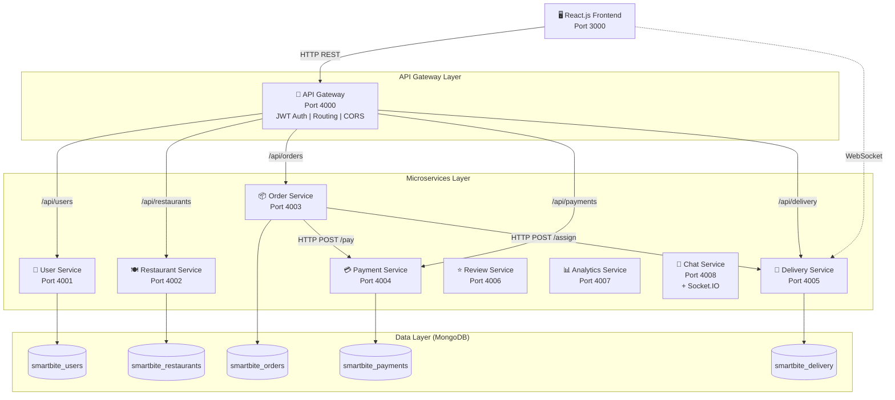
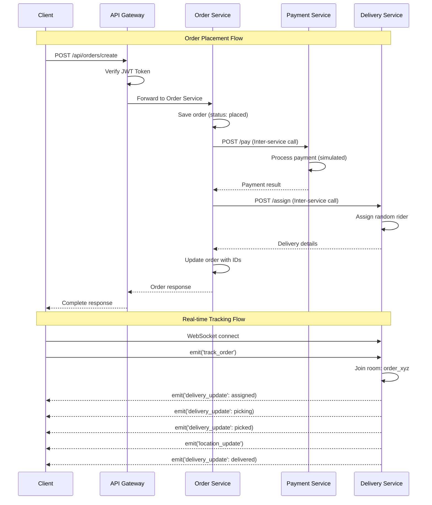
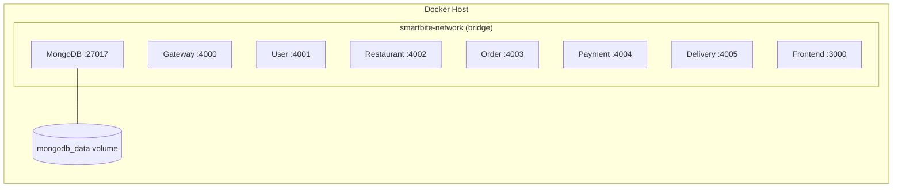

# SmartBite — System Architecture

## High-Level Architecture

```mermaid
graph TB
    Client["🖥️ React.js Frontend<br/>Port 3000"]
    
    subgraph Gateway["API Gateway Layer"]
        GW["🚪 API Gateway<br/>Port 4000<br/>JWT Auth | Routing | CORS"]
    end
    
    subgraph Services["Microservices Layer"]
        US["👤 User Service<br/>Port 4001"]
        RS["🍽️ Restaurant Service<br/>Port 4002"]
        OS["📦 Order Service<br/>Port 4003"]
        PS["💳 Payment Service<br/>Port 4004"]
        DS["🚴 Delivery Service<br/>Port 4005"]
        RE["⭐ Review Service<br/>Port 4006"]
        AS["📊 Analytics Service<br/>Port 4007"]
        CS["💬 Chat Service<br/>Port 4008<br/>+ Socket.IO"]
    end
    
    subgraph Data["Data Layer (MongoDB)"]
        DB1[(smartbite_users)]
        DB2[(smartbite_restaurants)]
        DB3[(smartbite_orders)]
        DB4[(smartbite_payments)]
        DB5[(smartbite_delivery)]
    end
    
    Client -->|HTTP REST| GW
    Client -.->|WebSocket| DS
    
    GW -->|/api/users| US
    GW -->|/api/restaurants| RS
    GW -->|/api/orders| OS
    GW -->|/api/payments| PS
    GW -->|/api/delivery| DS
    
    US --> DB1
    RS --> DB2
    OS --> DB3
    PS --> DB4
    DS --> DB5
    
    OS -->|HTTP POST /pay| PS
    OS -->|HTTP POST /assign| DS
```

## Inter-Service Communication Flow

```mermaid
sequenceDiagram
    participant C as Client
    participant G as API Gateway
    participant O as Order Service
    participant P as Payment Service
    participant D as Delivery Service

    Note over C,D: Order Placement Flow
    C->>G: POST /api/orders/create
    G->>G: Verify JWT Token
    G->>O: Forward to Order Service
    O->>O: Save order (status: placed)
    O->>P: POST /pay (Inter-service call)
    P->>P: Process payment (simulated)
    P-->>O: Payment result
    O->>D: POST /assign (Inter-service call)
    D->>D: Assign random rider
    D-->>O: Delivery details
    O->>O: Update order with IDs
    O-->>G: Order response
    G-->>C: Complete response

    Note over C,D: Real-time Tracking Flow
    C->>D: WebSocket connect
    C->>D: emit('track_order')
    D->>D: Join room: order_xyz
    D-->>C: emit('delivery_update': assigned)
    D-->>C: emit('delivery_update': picking)
    D-->>C: emit('delivery_update': picked)
    D-->>C: emit('location_update')
    D-->>C: emit('delivery_update': delivered)
```

## Docker Container Architecture

```mermaid
graph LR
    subgraph Docker["Docker Host"]
        subgraph Network["smartbite-network (bridge)"]
            M[MongoDB :27017]
            G[Gateway :4000]
            U[User :4001]
            R[Restaurant :4002]
            O[Order :4003]
            P[Payment :4004]
            D[Delivery :4005]
            F[Frontend :3000]
        end
        V[(mongodb_data volume)]
    end
    M --- V
```
