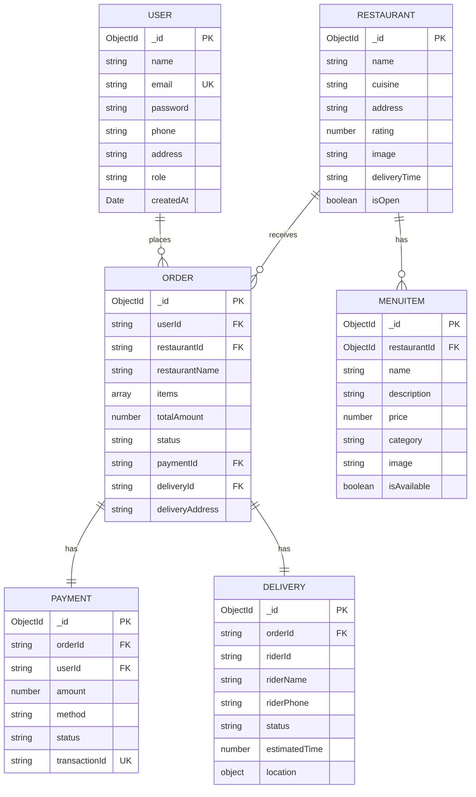

# SmartBite — Database Schema Documentation

## Database Strategy

SmartBite uses **database-per-service** pattern with MongoDB. Each microservice has its own dedicated database to ensure data isolation and loose coupling.

| Service | Database Name | Collections |
|---------|--------------|-------------|
| User Service | `smartbite_users` | users |
| Restaurant Service | `smartbite_restaurants` | restaurants, menuitems |
| Order Service | `smartbite_orders` | orders |
| Payment Service | `smartbite_payments` | payments |
| Delivery Service | `smartbite_delivery` | deliveries |

## Entity Relationship Diagram



## Sample Documents

### User
```json
{
  "_id": "507f1f77bcf86cd799439011",
  "name": "Ali Khan",
  "email": "ali@example.com",
  "password": "$2a$10$Xk7QJ...(bcrypt hash)",
  "phone": "0300-1234567",
  "address": "123 University Road, Karachi",
  "role": "customer",
  "createdAt": "2024-01-15T10:30:00.000Z"
}
```

### Restaurant
```json
{
  "_id": "507f1f77bcf86cd799439022",
  "name": "Karachi Biryani House",
  "cuisine": "Pakistani",
  "address": "123 University Road, Karachi",
  "rating": 4.5,
  "image": "https://images.unsplash.com/...",
  "deliveryTime": "30-40 min",
  "isOpen": true
}
```

### Order
```json
{
  "_id": "507f1f77bcf86cd799439033",
  "userId": "507f1f77bcf86cd799439011",
  "restaurantId": "507f1f77bcf86cd799439022",
  "restaurantName": "Karachi Biryani House",
  "items": [
    { "name": "Chicken Biryani", "price": 350, "quantity": 2 },
    { "name": "Raita", "price": 80, "quantity": 1 }
  ],
  "totalAmount": 780,
  "status": "confirmed",
  "paymentId": "507f1f77bcf86cd799439044",
  "deliveryId": "507f1f77bcf86cd799439055",
  "deliveryAddress": "456 Main Street, Karachi"
}
```
